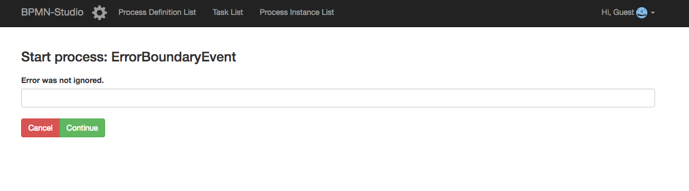
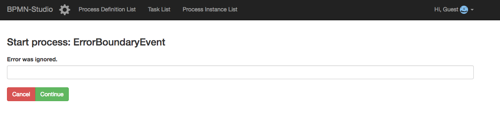

# ErrorBoundaryEvent

## How to use it

- Checkout the Branch
- Go into your Process Engine skeleton and start the database
- Go into the `ErrorBoundaryEvent` folder
- ```npm install && npm run build && npm start```
- Open `localhost:9000` and start the `ErrorBoundaryEvent` process

## What it does

This example adds a class and a function which simply throws an error when
it gets called. 
You can find the class in `src/boundary_error/error_boundary_test.ts`

### If it works:



### If it doesn't work:


