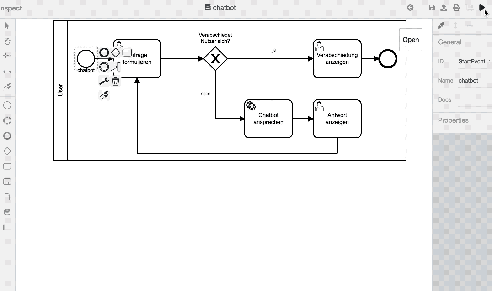

# Chatbot

Bei dem hier modellierten Prozess wird das Gespräch mit einem
Chatbot eröffnet.

Das Beispiel besteht nicht nur aus dem Diagramm, sondern auch aus
einem Programm für den Chatbot.

Es bildet sich die Brücke zwischen _Prozessmodellierung_ und
_Softwareentwicklung_.

Um die saubere Trennung dieser Bereiche zu verdeutlichen, wird auch die
Anleitung geteilt in:
1. [Prozessmodellierung](./README_Modeller.md) und
1. [Softwareentwicklung](./README_Programmer.md).

## Lernziele

- Bereitstellen von ExternalTasks
- Aufrufen von ExternalTasks

## Aufsetzen des Demoprojekts

- Herunterladen des Repositories: `git clone git@github.com:process-engine/example_processes.git`
- Navigieren zum Projektordner: `cd example_processes/solutions/Chatbot`
- Installieren von Fremdbibliotheken: `npm i`
- Starten der Applikation: `npm start`
- Importieren des BPMN-Diagramms `example_processes/solutions/Chatbot/bpmn/chatbot.bpmn` mit BPMN-Studio

## Ausführung

Hier eine kurze Aufnahme vom Chatbot in Aktion:

