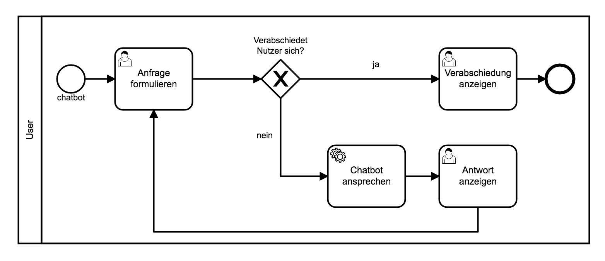
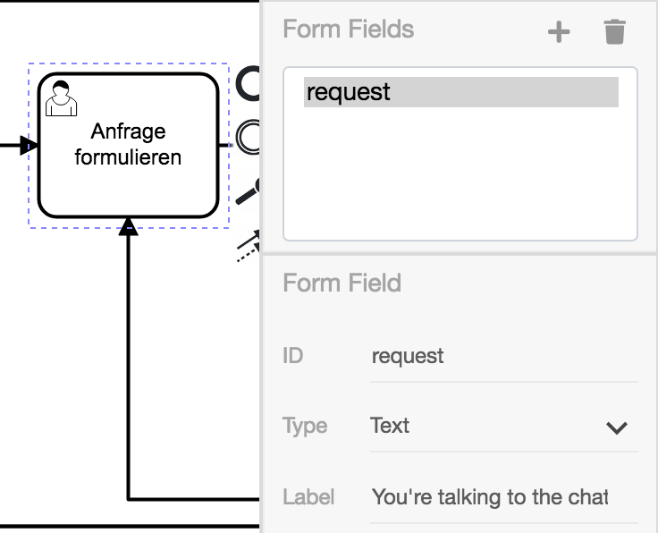
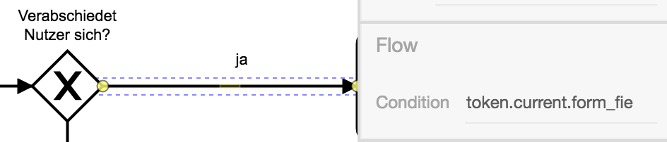
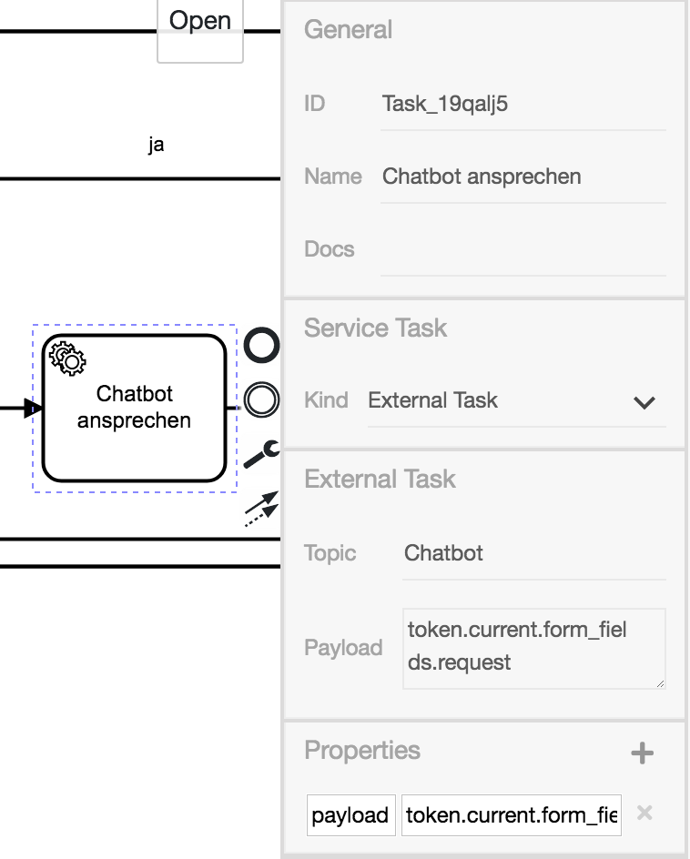

# Chatbot - Anleitung für Prozessmodellierer

Während der Programmierer Dienste für die ProcessEngine bereitstellen
muss, liegt es am Prozessmodellierer Anforderungen zu definieren und
diese Dienste einzubinden.

Kern dieses Diagramms ist die Verwendung des ExternalTasks und ein
Verständnis für die Aufgabenbereiche und das Zusammenspiel von
Modellierern und Programmierern.

## Lernziele

- Verwendung eines ExternalTasks
- Modellierung einer Schleife mit Abbruchbedingung

## Aufbau

Das fertige Diagramm sieht so aus:

Im Folgenden werden die Elemente des Diagramms und ihre Konfiguration
vorgestellt.

### UserTask (Anfrage formulieren)

In diesem UserTask wird der Anwender um eine Anfrage gebeten. Wir
erstellen ein Formular mit einem Feld vom Typ `Text` und der ID
`request`.

Mit dem Label `You're talking to the chatbot. Please make a request.`
bitten wir den Nutzer um eine Anfrage.

### ExclusiveGateway

Wir wollen mit dem ExclusiveGateway eine Möglichkeit bieten, abhängig
von der Nutzereingabe, den Prozess zu beenden.

Daher erstellen wir folgend auf den UserTask ein ExclusiveGateway mit
der Beschriftung `Verabschiedet sich Nutzer?`.

### Prozessende

Wir erstellen einen neuen UserTask mit der Beschriftung
`Verabschiedung anzeigen`. Diesen machen wir zu einem Confirm-Dialog
mit der Meldung `Goodbye.`. Der UserTask wird mit einem EndEvent
verbunden.

Nun verbinden wir das ExclusiveGateway mit dem Verabschiedungstask.

Der verbindende Sequenz-Flow erhält die Condition
`token.current.form_fields.request.toLowerCase().match('bye|goodbye|quit|exit')`.
`token.current` referenziert den `Anfrage formulieren`-UserTask.
Entsprechend der Gateway-Beschriftung wird in der Abfrage überprüft,
ob der Nutzer sich verabschieden möchte.

Zudem beschriften wir den Pfad mit der Antwort `Ja` auf die Frage des Gateways.

### Antwort des Chatbots generieren

Wir erstellen einen ServiceTask mit dem Namen `Chatbot ansprechen`.
Hierbei handelt es sich um die Schnittstelle zu dem bereitgestellten Dienst.

Wir stellen ein, dass es sich um einen ExternalTask handelt. Zudem
setzen wir als Topic `Chatbot` und übergeben als Payload
`token.current.form_fields.request` (die Anfrage des Nutzers).

Diese Angaben sind wichtig für den Programmierer. Er benötigt das
Topic um den ExternalTaskWorker auf dieses zu subscriben und den
Payload um auf dessen Basis eine Antwort generieren zu können.

Ausgehend vom Gateway erstellen wir einen Flow zum ServiceTask mit der
Beschriftung `Nein` und der Condition
`!token.current.form_fields.request.toLowerCase().match('bye|goodbye|quit|exit')`.
Hierbei handelt es sich um die negierte Condition des Abbruch-Flows.

### Antwort des Chatbots präsentieren / Schleife

Dem ServiceTask folgend erstellen wir einen UserTask zur Darstellung
der Antwort. Hierbei handelt es sich um einen Confirm-UserTask mit dem
Label `${token.current}` und der Beschriftung `Antwort anzeigen`.

Nachdem der Nutzer die Antwort entgegengenommen hat, soll er eine neue
Anfrage stellen können. Daher erstellen wir einen Flow, welcher zu dem
`Anfrage formulieren`-UserTask zurückführt.
