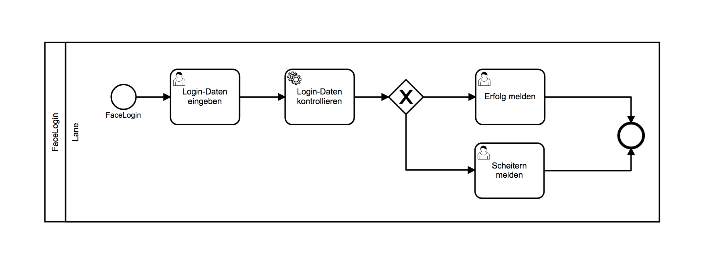

# FaceLogin
Mit diesem Projekt wird eine ProcessEngine-Instanz mitsamt lauffähigem
Beispieldiagramm gestartet.

Bei dem Beispiel wird die [Microsoft Azure
Gesichtserkennungs-API](https://azure.microsoft.com/de-de/services/cognitive-services/face/)
für ein Login genutzt.



Neben dem BPMN-Diagramm und der ProcessEngine beinhaltet dieses
Projekt eine Aurelia- und eine Server-Applikation, welche in dem
Beispieldiagramm genutzt werden.

Der Nutzer wird auf eine lokal gehostete Webseite verwiesen, wo er einen [Account anlegen](http://localhost:3000/static/user-registration) und seine [FaceId generieren](http://localhost:3000/static/#/generate-face-id) kann (Seiten sind erst nach Ausführen des Setups erreichbar).

Der erste UserTask präsentiert dem Nutzer ein Formular zur Eingabe der Kenndaten.
Der ServiceTask kontrolliert ob die FaceId des Nutzers zum Eintrag passt.
Anschließend wird dem Nutzer mittels UserTask Erfolg oder Misserfolg des Logins gemeldet.

## Voraussetzung
Um den Beispielprozess betrachten, starten und verändern zu können,
wird das [BPMN-Studio](https://github.com/process-engine/bpmn-studio)
benötigt.  Zudem muss die Datenbank aus dem [ProcessEngine
Skeleton](https://github.com/process-engine/skeleton/tree/develop/database)
gestartet werden.

## Setup

- Herunterladen des Repositorys: ```git clone git@github.com:process-engine/example_processes.git```
- Navigieren zum Projektordner: ```cd example_processes/solutions/FaceLogin```
- Installieren von Fremdbibliotheken und Transpilieren des Projektes: ```npm install && npm run build && npm start```
- Das Beispieldiagramm steht nun auf <localhost:8080> in dem
  BPMN-Studio zur Verfügung.
