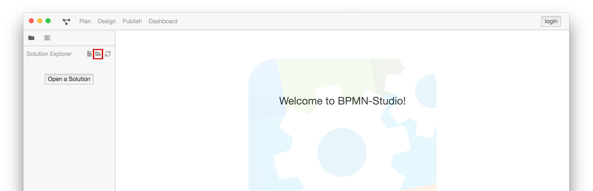
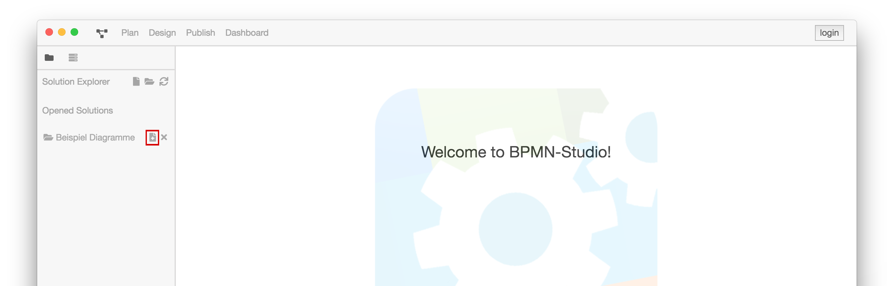
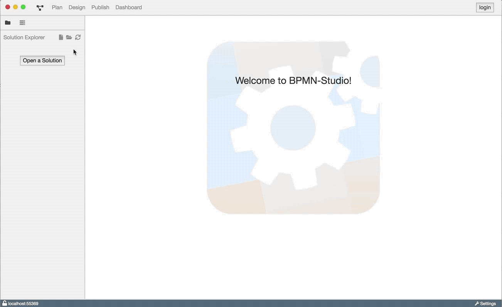
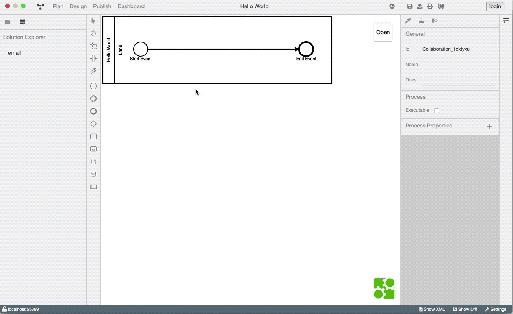
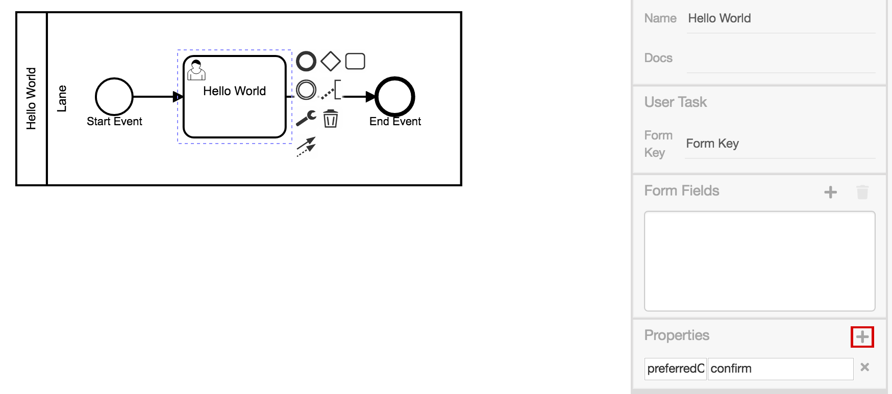
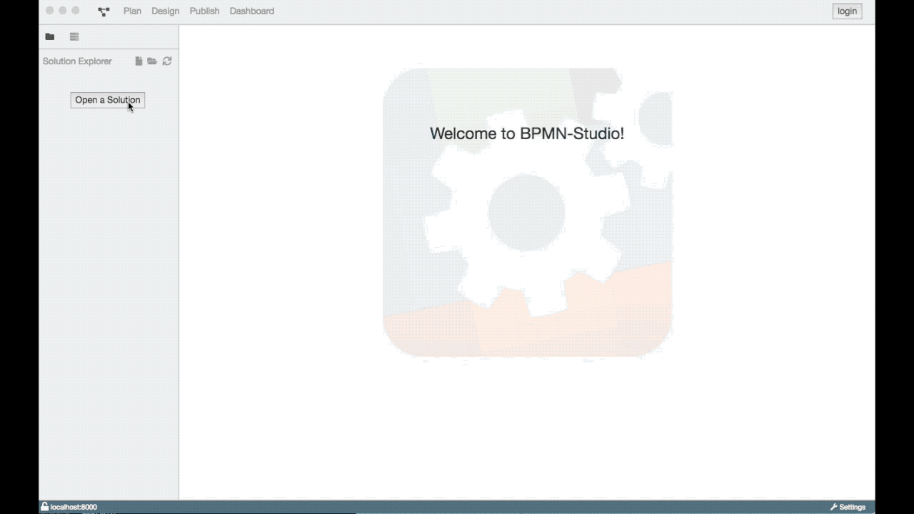

# Hello BPMN-World

Um den Umgang der ProcessEngine und des BPMN-Studios zu demonstrieren, wird ein
einfaches Beispiel Diagramm erstellt.

Ziel ist es, ein BPMN-Diagramm mit einem
[Single User Task](https://www.process-engine.io/documentation/GLOSSARY.html#user-task)
zu erstellen.

Das Diagramm sieht folgendermaßen aus:

Dieser [User Task](https://www.process-engine.io/documentation/GLOSSARY.html#user-task) wird die folgenden Elemente
enthalten:

1. die Nachricht `Hello World`
2. eine Schaltfläche zum Bestätigen

Letzteres dient dazu, den [Task](https://www.process-engine.io/documentation/GLOSSARY.html#task) zu beenden.

## Erstellung eines neuen Diagramms

Zunächst wird ein neues Diagramm benötigt.
Der Solution Explorer ermöglicht uns ein neues Diagramm innerhalb einer Solution
zu erstellen.

Dazu klickt man zunächst im Solution Explorer auf den "Open a Solution"-Button.

Es öffnet sich ein Fenster zur Auswahl eines Ordners.
Bestätigt man den ausgewählten Ordner mit einem Klick auf "Öffnen" erscheint der
Ordner als Solution im Solution Explorer. Jetzt kann man mit dem "Datei
hinzufügen"-Button ein neues Diagramm erstellen.

Es erscheint ein Textfeld, in dem der Name für die Datei eingegeben wird.
In diesem Fall wird `Hello World` gewählt.

Nach dem Erstellen öffnet sich die Design-Ansicht automatisch mit dem gerade
erstellten Diagramm.

So sieht das Ganze  aus:

## Modellierung eines Diagramms

Die Design-Ansicht zeigt uns ein Diagramm mit einer
[Lane](https://www.process-engine.io/documentation/GLOSSARY.html#lane), einem Startevent und einem Endevent.

Durch das Auswählen eines Elements öffnet sich ein Kontextmenü; dieses Menü
erlaubt es neue Elemente hinzuzufügen; diese werden direkt mit dem ausgewählten
Element verbunden.

Der Sequenzfluss vom Startevent zum Endevent wird zunächst entfernt.
An dem Startpunkt wird ein [UserTask](https://www.process-engine.io/documentation/GLOSSARY.html#user-task)
mit dem Namen `Hello Word` verbunden; an diesem das Endevent.

Das Ganze sollte so aussehen:

Im folgenden Video, fassen wir die Schritte zusammen:

## Umsetzung eines User Task

Ein [UserTask](https://www.process-engine.io/documentation/GLOSSARY.html#user-task) kann so konfiguriert werden, dass
dem Benutzer eine grafische Oberfläche präsentiert wird, in der er aufgefordert
wird ein Formular auszufüllen oder das Angezeigte zu bestätigen.

In diesem Beispiel wird eine Confirm Ansicht erstellt. Um das zu erreichen,
muss der UserTask folgendermaßen konfiguriert werden:

1. In dem Property Panel rechts unter dem Punkt Properties lässt sich die
   anzuzeigende Oberfläche mittels Key-Value Paaren definieren:

   Hier fügen wir eine Property namens `preferredControl` mit dem Wert `confirm` hinzu.

   

1. Ein FormField mit dem Typ Boolean wird benötigt.

   Das Label stellt die Nachricht, die nur bestätigt werden soll, dar.

   **Wichtig:** Wenn der UserTask eine Confirm Ansicht anzeigen soll, muss
   immer das **ERSTE** FormField vom Typ `boolean` sein.
   Die Id spielt dabei keine Rolle.

   

**Zusammenfassung**

Was wir getan haben?

Wir haben:

- Einen [User Task](https://www.process-engine.io/documentation/GLOSSARY.html#user-task) namens `Hello World` erstellt.
- Den Task mit einer Konfiguration für die Oberfläche versehen.
- Die verschiedenen Ausführungsschritte miteinander verdrahtet.

Hier ist noch einmal der komplette Ablauf mit Ausführung des Prozesses zu sehen:

