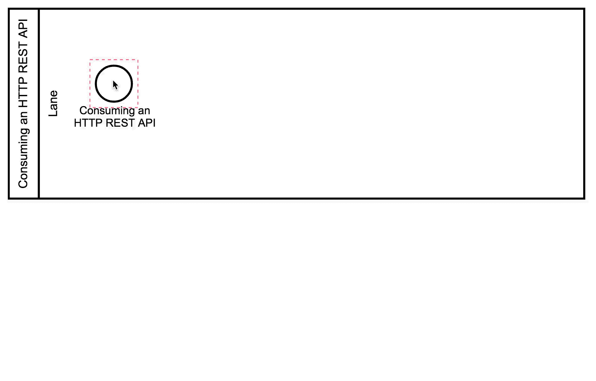
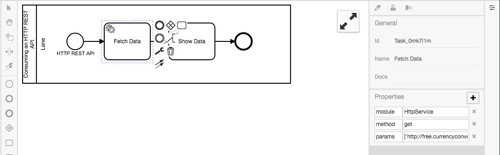
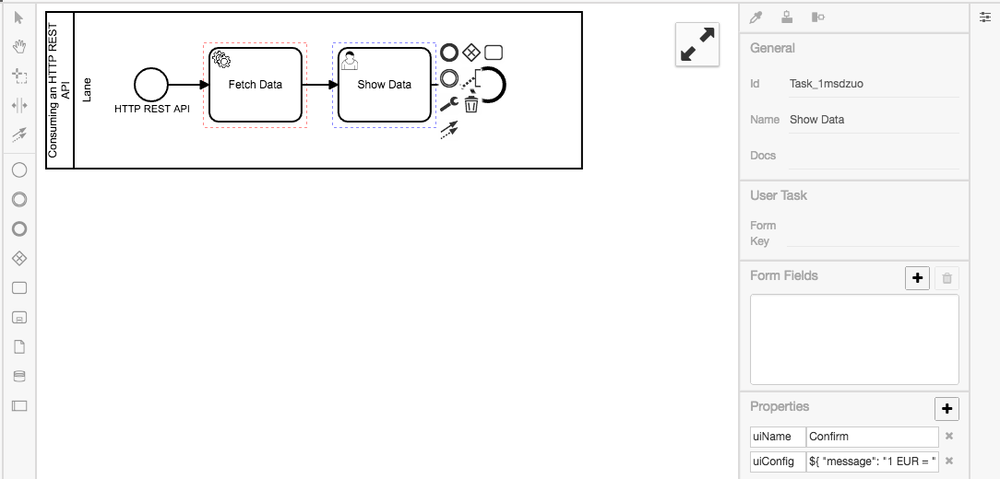
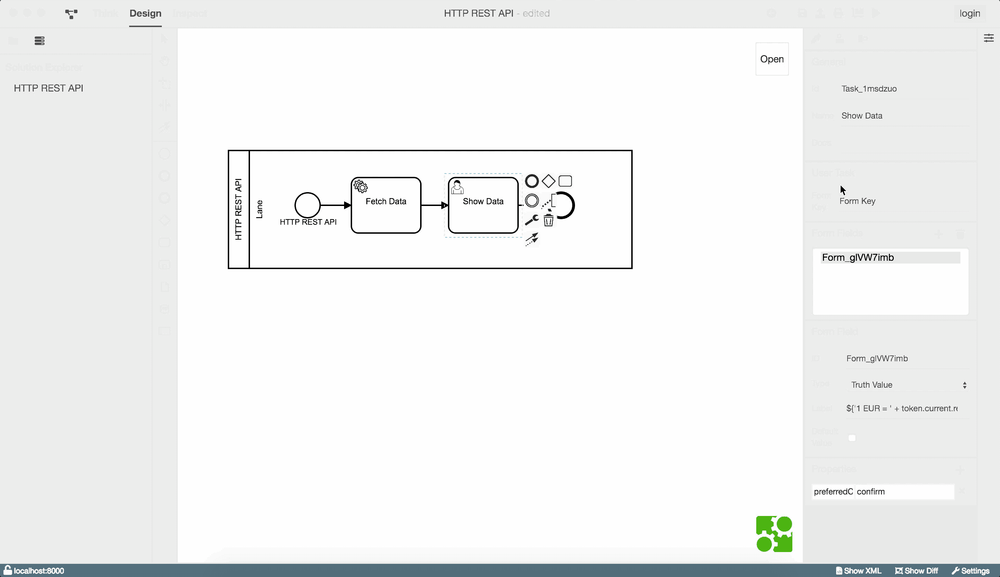

# Verwendung einer REST API

In diesem Beispiel werden Wechselkurse von einer REST API geladen und
dargestellt.

Erstelle dazu ein neues Diagramm, analog zum Hello World Beispiel.

Erstelle dann einen [Service Task](https://www.process-engine.io/documentation/GLOSSARY.html#service-task), um
Daten zu laden und einen [User Task](https://www.process-engine.io/documentation/GLOSSARY.html#user-task), um die
Daten anzuzeigen:

</img>

Innerhalb des Property Panels lässt sich nun ebenfalls mittels Key-Value Paaren
der [Service Task](https://www.process-engine.io/documentation/GLOSSARY.html#service-task) definieren.
In unserem Fall soll der `Fetch Data` Task einen `GET - request` auf der
angegebenen URL ausführen.
Die Antwort wird anschließend als aktueller Token Wert festgelegt.

Dazu müssen dem Element im Property Panel die folgenden Properties hinzugefügt werden:

```
module    HttpService
method    get
params    ['http://free.currencyconverterapi.com/api/v5/convert?q=EUR_USD&compact=y']
```



Zum Schluss muss dem [User Task](https://www.process-engine.io/documentation/GLOSSARY.html#user-task)
(`Show Data`) nur noch gesagt werden, was er anzeigen soll. Dies geschieht
wieder über das Property Panel.

User Tasks können sowohl Bestätigungsdialoge als auch Formulare anzeigen.
Da wir hier keine Eingabe vom Nutzer benötigen, erstellen wir einen
Bestätigungsdialog.
Dazu erstellen wir die Property `preferredControl` mit dem Wert `confirm`.
Zusätzlich erstellen wir ein Formularfeld vom Typ `Truth value`.
In dem Feld `Label` können wir unsere Nachricht an den Nutzer eintragen:
```
${'1 EUR =' + token.current.result.EUR_USD.val + '$'}
```

Die gesonderte Syntax `${...}` erlaubt den Zugriff auf Werten des Tokens. Mit dem `+`-Operator kann der Inhalt vom Token mit den Zeichenketten `'1 EUR = '` und `'$'` verbunden.




Zusammengefasst sieht der Konfigurationsvorgang so aus:

</img>

**Zusammenfassung**

In diesem Tutorial haben wir:
- einen [Service Task](https://www.process-engine.io/documentation/GLOSSARY.html#service-task) zum Ausführen des
HTTP GET Requests definiert
- einen [User Task](https://www.process-engine.io/documentation/GLOSSARY.html#user-task) angelegt, der uns den
gewünschten Umrechnungskurs anschaulich darstellt

Zeit den Prozess auszuführen:

</img>
