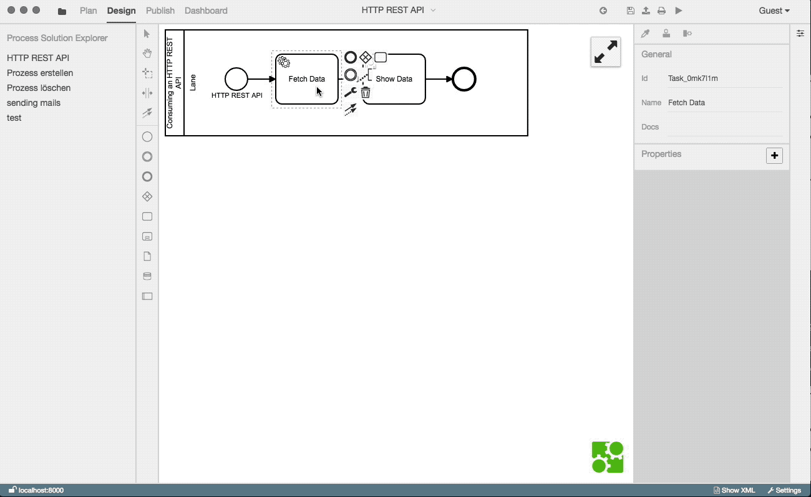

# Verwendung einer REST API

In diesem Beispiel werden Wechselkurse von einer REST API geladen und
dargestellt.

Erstelle dazu ein neues Diagramm, analog zum Hello World Beispiel.

Erstelle dann einen [Service Task](../../GLOSSARY.md#service-task), um
Daten zu laden und einen [User Task](../../GLOSSARY.md#user-task), um die
Daten anzuzeigen:

</img>

Innerhalb des Property Panels lässt sich nun ebenfalls mittels Key-Value Paaren
der [Service Task](../../GLOSSARY.md#service-task) definieren.
In unserem Fall soll der `Fetch Data` Task einen `GET - request` auf der
angegebenen URL ausführen.
Die Antwort wird anschließend als aktueller Token Wert festgelegt.

Dazu müssen dem Element im Property Panel die folgenden Properties hinzugefügt werden:

```
module    HttpService
method    get
params    ['http://free.currencyconverterapi.com/api/v5/convert?q=EUR_USD&compact=y']
```


Als Nächstes wird dem [Sequenzfluss](../../GLOSSARY.md#sequenzfluss) von
dem `Fetch Data` zum `Show Data` Task mitgeteilt, wie das Ergebnis interpretiert
und an den User [Task](../../GLOSSARY.md#task) weitergegeben werden soll.

Die [Sequenzflusszuordnung](../../GLOSSARY.md#sequenzfluss) definiert,
wie die im vorherigen [Task](../../GLOSSARY.md#task) empfangenen Daten im
Token aufbewahrt werden.

In diesem Fall sollen nicht alle Wechselkurse angezeigt werden, sondern
lediglich der USD Kurs.

Um das zu erreichen wird ihm - wieder im Property Panel - die Property
```mapper   token.current.result.EUR_USD.val```
mitgegeben.


Nach dem Mapping kann der nächste BPMN-Knoten nach dem [Sequenzfluss](../../GLOSSARY.md#sequenzfluss)
den USD Kurs durch den Zugriff auf `token.current` nutzen.

Zum Schluss muss dem [User Task](../../GLOSSARY.md#user-task)
(`Show Data`) nur noch gesagt werden, was er anzeigen soll. Dies geschieht
wieder über das Property Panel.

Dazu setzen wir `Confirm` als `uiName`, um einen Bestätigungsdialog zu
verwenden und konfigurieren diesen mit folgender `uiConfig`:

```
${ "message": "1 EUR = " + token.current + " USD", "layout": [ { "key":
"confirm", "label": "OK"}] };
```


Zusammengefasst sieht der Konfigurationsvorgang so aus:

</img>

**Zusammenfassung**

In diesem Tutorial haben wir:
- einen [Service Task](../../GLOSSARY.md#service-task) zum Ausführen des
HTTP GET Requests definiert
- einen Mapper definiert, der uns den gewünschten Umrechnungskurs aus dem
Ergebnis des `Service Tasks` holt
- einen [User Task](../../GLOSSARY.md#user-task) angelegt, der uns den
gewünschten Umrechnungskurs anschaulich darstellt

Zeit den Prozess auszuführen:

</img>
