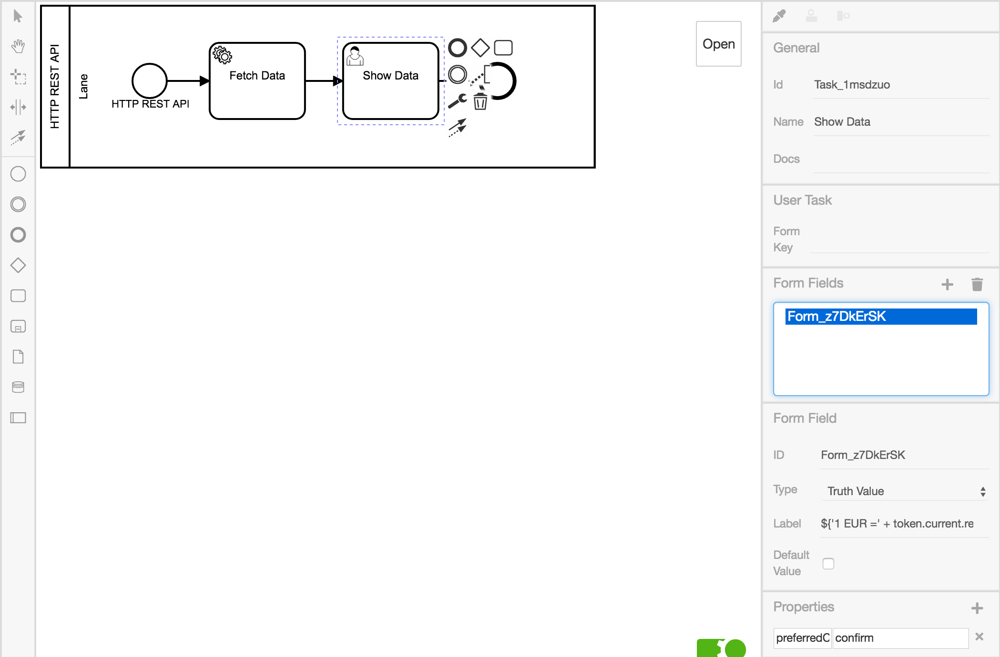

# Verwendung einer REST API

In diesem Beispiel werden Wechselkurse von einer REST API geladen und
dargestellt.

Erstelle dazu ein neues Diagramm, analog zum Hello World Beispiel.

Erstelle dann:

* einen
  [Service Task](https://www.process-engine.io/documentation/GLOSSARY.html#service-task),
  um Daten zu laden und einen
* [User Task](https://www.process-engine.io/documentation/GLOSSARY.html#user-task),
  um die Daten anzuzeigen.

Das Ganze sollte so aussehen:

</img>

Innerhalb des Property Panels lässt sich nun mittels Key-Value Paaren der
[Service Task](https://www.process-engine.io/documentation/GLOSSARY.html#service-task)
definieren.

In unserem Fall soll der `Fetch Data` Task einen `GET - request` auf der
angegebenen URL ausführen. Die Antwort wird anschließend als aktueller Token
Wert festgelegt.

Dazu müssen dem Element im Property Panel die folgenden Properties hinzugefügt
werden:

```
module    HttpService
method    get
params    ['http://free.currencyconverterapi.com/api/v5/convert?q=EUR_USD&compact=y']
```

Zum Vergleich, so sollte das aussehen:


Zum Schluss muss der
[User Task](https://www.process-engine.io/documentation/GLOSSARY.html#user-task)
(`Show Data`) konfiguriert werden, um die korrekte Anzeige zu erreichen.

Dies geschieht wieder über das Property Panel.

User Tasks können sowohl Bestätigungsdialoge als auch Formulare anzeigen.
Da wir hier keine Eingabe vom Nutzer benötigen, erstellen wir einen
Bestätigungsdialog.

Dazu erstellen wir:

1. die Property `preferredControl` mit dem Wert `confirm`,
1. ein Formularfeld vom Typ `Truth value`,
1. ein Feld `Label` und tragen unsere Nachricht an den Nutzer ein:

   ```
   ${'1 EUR =' + token.current.result.EUR_USD.val + '$'}
   ```

   Die gesonderte Syntax `${...}` erlaubt den Zugriff auf Werten des Tokens. Mit dem `+`-Operator kann der Inhalt vom Token mit den Zeichenketten `'1 EUR = '` und `'$'` verbunden.

Das Ganze sieht so aus:



Zusammengefasst sieht dergesamte Konfigurationsvorgang so aus:

</img>

**Zusammenfassung**

In diesem Tutorial haben wir:

1. Einen
   [Service Task](https://www.process-engine.io/documentation/GLOSSARY.html#service-task)
   zum Ausführen des HTTP GET Requests definiert.
1. Einen
   [User Task](https://www.process-engine.io/documentation/GLOSSARY.html#user-task)
   angelegt, der uns den gewünschten Umrechnungskurs anschaulich darstellt

Es ist nun Zeit, den Prozess auszuführen:

</img>
