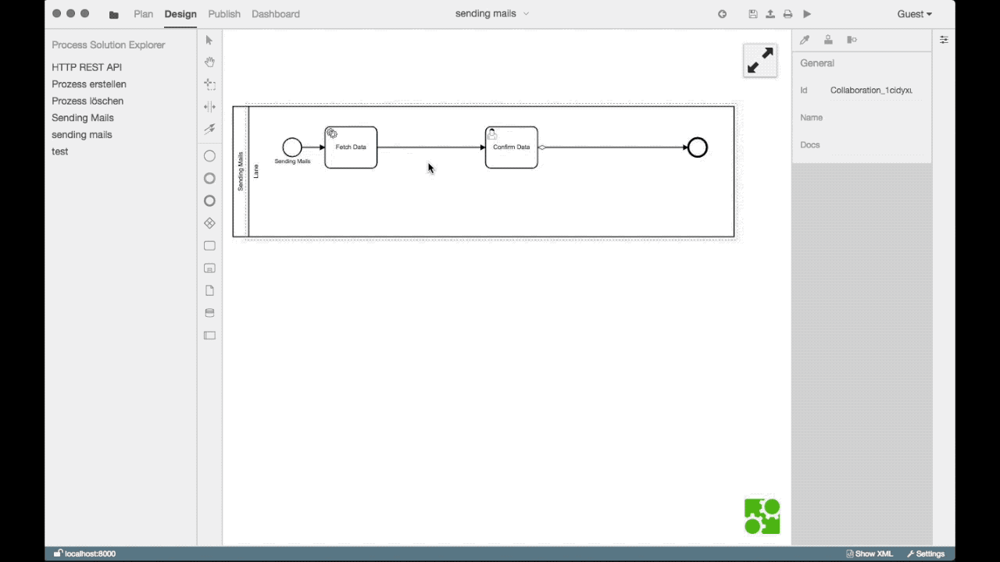
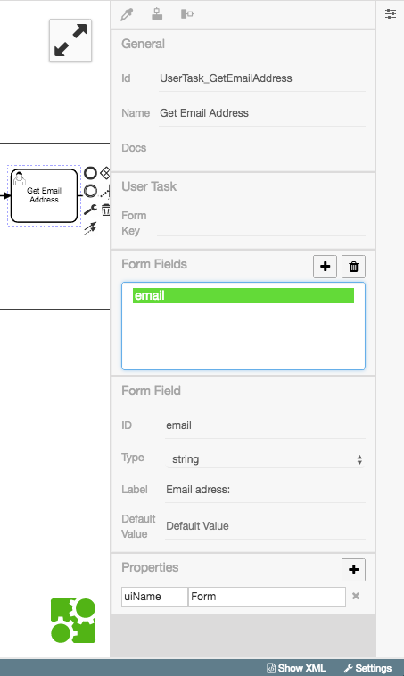
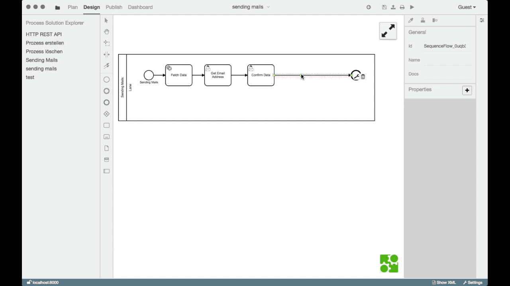

# Emails versenden

In diesem Beispiel wird ein Prozess für den Versand von Emails modelliert.

Dazu muss der Prozess um die folgenden drei
[Tasks](../../GLOSSARY.md#task) erweitert werden:

1. Die Abfrage der Email-Adresse
1. Die Anforderung einer Bestätigung
1. Den Versand einer Email mit dem Wechselkurs

## Prozessschritte anlegen

Wir erstellen ein Diagramm mit folgenden Bestandteilen:

1. [Startevent](../../GLOSSARY.md#event)
1. [User Task](../../GLOSSARY.md#user-task): `Enter Email Address`
1. [User Task](../../GLOSSARY.md#user-task): `Confirm Email Address`
1. [XOR-Gateway](../../GLOSSARY.md#gateway), welches unterscheidet, ob im vorherigen Usertask
   bestätigt wurde
1. [Service Task](../../GLOSSARY.md#service-task) `Send Email`
1. [Endevent](../../GLOSSARY.md#event)

Im Folgenden wird Erstellung und Konfiguration dieser Elemente gezeigt.

### [User Task](../../GLOSSARY.md#user-task)User Task zur Eingabe der Emailadresse

Zu Beginn erstellt man einen [User Task](../../GLOSSARY.md#user-task)
mit dem Namen `Get Email Address`. Dieser fordert den User per UI dazu
auf eine E-Mail anzugeben.

Da wir auf die Eingabe des Nutzers zugreifen werden, lohnt es sich den
User Task und das Formularfeld zu benennen.  Wir bezeichnen den User
Task als `usertask_enter_email` und das Formularfeld als `email`.



Es ergibt sich mit folgender Konfiguration:



### [User Task](../../GLOSSARY.md#user-task) für Bestätigungsdialog

Ein weiterer [User Task](../../GLOSSARY.md#user-task) soll dem Nutzer die Möglichkeit geben, den
Prozess abzubrechen.

### [XOR-Gateway](../../GLOSSARY.md#gateway)

Als Nächstes wird eine Überprüfung angelegt.

Es ist zu prüfen, ob in dem `Confirm Data`-[Task](../../GLOSSARY.md#task)
Confirm oder Cancel ausgewählt wurde; wir benutzen ein `Gateway` dafür.

Diese Auswahl hat Einfluss auf den weiteren Prozessweg. Cancel beendet den
Prozess; Confirm löst den `Send email`-[Task](../../GLOSSARY.md#task)
aus.

### [Service Task](../../GLOSSARY.md#service-task) für Versand der Email

Der letzte Prozessschritt ist der `Send
email`-[Task](../../GLOSSARY.md#task). Dieser muss die folgenden
Eigenschaften erhalten:

```
module  MailService
method  send
params  [null, token.history.UserTask_GetEmailAddress.email, "EUR to USD conversion rate", "1 EUR = " + token.history.ServiceTask_FetchData.result.EUR_USD.val + " USD"]
```

Nach diesem [Task](../../GLOSSARY.md#task) muss der Prozess beendet
werden.


