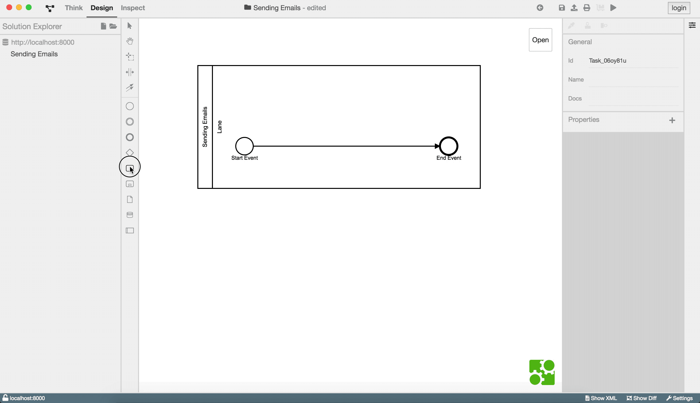
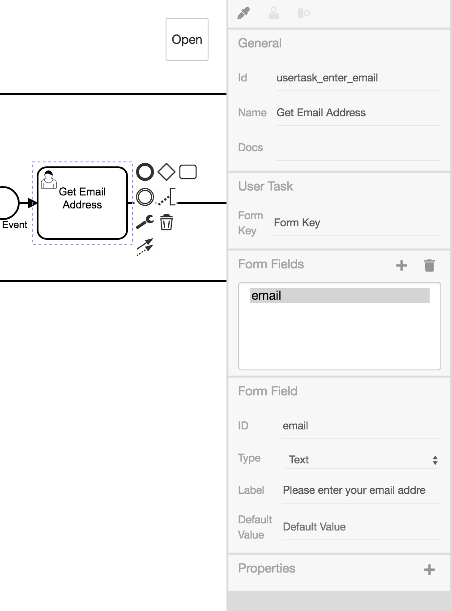

# Emails versenden

In diesem Beispiel wird ein Prozess für den Versand von Emails modelliert.

## Prozessschritte anlegen

Wir erstellen ein Diagramm mit folgenden Bestandteilen:

1. [Startevent](https://www.process-engine.io/documentation/GLOSSARY.html#event)
1. [User Task](https://www.process-engine.io/documentation/GLOSSARY.html#user-task)
   : `Enter Email Address`
1. [User Task](https://www.process-engine.io/documentation/GLOSSARY.html#user-task)
   : `Confirm Email Address`
1. [XOR-Gateway](https://www.process-engine.io/documentation/GLOSSARY.html#gateway)
   : unterscheidet, ob im vorherigen Usertask bestätigt wurde
1. [Service Task](https://www.process-engine.io/documentation/GLOSSARY.html#service-task)
   : `Send Email`
1. [Endevent](https://www.process-engine.io/documentation/GLOSSARY.html#event)

Im Folgenden wird Erstellung und Konfiguration dieser Elemente gezeigt.

### [User Task](https://www.process-engine.io/documentation/GLOSSARY.html#user-task) zur Eingabe der Emailadresse

Zu Beginn erstellt man einen
[User Task](https://www.process-engine.io/documentation/GLOSSARY.html#user-task)
mit dem Namen `Get Email Address`. Dieser fordert den User per UI dazu
auf eine Email anzugeben.

Da wir auf die Eingabe des Nutzers zugreifen werden, lohnt es sich, den
User Task und das Formularfeld zu benennen.  Wir bezeichnen den User
Task als `usertask_enter_email` und das Formularfeld als `email`.  Bei
dem Formularfeld fügen wir ein Label hinzu mit dem Inhalt `Please
enter your Email address:`.



Es ergibt sich folgende Konfiguration:



### [User Task](https://www.process-engine.io/documentation/GLOSSARY.html#user-task) für Bestätigungsdialog

Ein weiterer [User
Task](https://www.process-engine.io/documentation/GLOSSARY.html#user-task)
soll dem Nutzer die Möglichkeit geben, den Prozess abzubrechen.  Wir
erstellen den User Task mit der Id `usertask_email_confirm` und dem
Namen `Confirm Data`.  Für User Tasks zur Bestätigung benötigen wir
zudem die Property `preferredControl` mit dem Wert `confirm` und ein
Formularfeld vom Typ `Truth value`.  Als Label benutzen wir `${"Do you
want to send an email to " +
token.history.usertask_enter_email.form_fields.email +
"?"}`.

Innerhalb der `${...}`-Syntax können wir auf Inhalte des Tokens
zugreifen. `token.history.usertask_enter_email.form_fields.email`
erlaubt uns den Zugriff auf den Wert, welchen der Nutzer in dem
vorherigen User Task mit der Id `usertask_enter_email` eingibt. Mit
dem `+`-Zeichen kann dieser Wert mit Zeichenketten verbunden werden.


### [XOR-Gateway](https://www.process-engine.io/documentation/GLOSSARY.html#gateway)

Als Nächstes wird eine Überprüfung angelegt.

Es ist zu prüfen, ob in dem `Confirm Data`-[Task](https://www.process-engine.io/documentation/GLOSSARY.html#task)
Confirm oder Cancel ausgewählt wurde; wir benutzen ein `Gateway` dafür.

Diese Auswahl hat Einfluss auf den weiteren Prozessweg. Cancel beendet
den Prozess; Confirm löst den `Send
email`-[Task](https://www.process-engine.io/documentation/GLOSSARY.html#task)
aus.

Die Fallunterscheidung erfolgt bei der Konfiguration der
Sequenzflüsse, die dem XOR-Gateway folgen.

Einer der Flüsse führt zum Endevent mit der Condition
`token.history.usertask_enter_email.form_fields.email === "true"`.
Der andere Fluss trägt die Condition
`token.history.usertask_enter_email.form_fields.email === "false"` und
führt zu dem Service Task zum Versand der Mail.


### [Service Task](https://www.process-engine.io/documentation/GLOSSARY.html#service-task) für Versand der Email

Der letzte Prozessschritt ist der `Send
email`-[Task](https://www.process-engine.io/documentation/GLOSSARY.html#task). Dieser
muss die folgenden Eigenschaften erhalten:

```
module  MailService
method  send
params  [null, token.history.usertask_enter_email.form_fields.email, "Regarding Hello World", "Hello World!"]
```


## Vollständige Konfiguration

Hier ist eine Aufnahme der kompletten Konfiguration des Prozesses:

