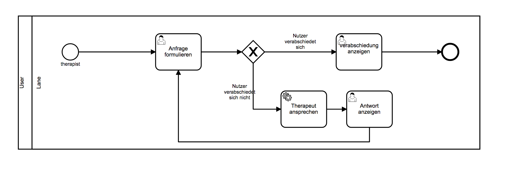

# Therapist

Mit diesem Projekt wird eine ProcessEngine-Instanz mitsamt lauffähigem
Beispieldiagramm gestartet.

Mit dem Start des Diagramms wird ein Gespräch mit einem Chatbot
begonnen.  Gespräch und Prozess kann mit einer Verabschiedung beendet
werden (bye, goodbye, quit oder exit als Eingabe).

Für die Funktion des Chatbots wird
[elizabot](https://github.com/tkafka/node-elizabot) verwendet.



## Voraussetzungen

- [BPMN-Studio](https://github.com/process-engine/bpmn-studio) installiert & gestartet
- Datenbank aus [ProcessEngine
Skeleton](https://github.com/process-engine/skeleton/tree/develop/database)
gestartet

## Setup

- Herunterladen des Repositorys: ```git clone git@github.com:process-engine/example_processes.git```
- Navigieren zum Projektordner: ```cd example_processes/solutions/Therapist```
- Installieren von Fremdbibliotheken: ```npm i```
- Starten der Applikation `npm start`:
- Das Beispieldiagramm steht nun unter dem Namen `Therapist` in dem
  BPMN-Studio zur Verfügung.
