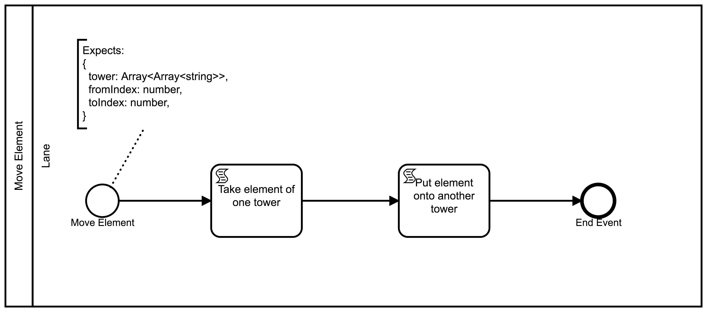
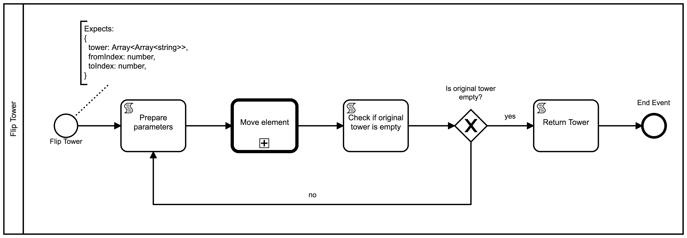

# Towers

Einer der wichtigsten Faktoren von BPMN ist die Modularität. Indem wir
komplexe Vorgänge auf mehrere Diagramme verteilen, erreichen wir mehr
Ordnung und Austauschbarkeit.

Das hier vorgestellte Beispiel demonstriert das Zusammensetzen
mehrerer Diagramme zur Lösung eines Problems.

## Szenario

In unserem Szenario wollen wir einen Stapelturm von Elementen
verschieben. Die Reihenfolge der Elemente soll gleich bleiben. Die
Ausgangssituation sieht so aus:

```
A
B
C
-  -  -
0  1  2
```

Wir wollen den Turm von der Position `0` zu Position `2` verschieben:

```
      A
      B
      C
-  -  -
0  1  2
```

Es ist jedoch nur möglich, das oberste Element des Turms zu
bewegen. So können wir etwa `A` von `0` auf `1` verschieben:

```

B
C  A
-  -  -
0  1  2
```

Nach kurzer Betrachtung kommt man zur folgenden Lösung:

```
A       |         |         |    C    |         |         |       A
B       | B       |    B    |    B    |    B    |       B |       B
C       | C  A    | C  A    |    A    |    A  C |    A  C |       C
-  -  - | -  -  - | -  -  - | -  -  - | -  -  - | -  -  - | -  -  -
0  1  2 | 0  1  2 | 0  1  2 | 0  1  2 | 0  1  2 | 0  1  2 | 0  1  2
        ⤻         ⤻         ⤻         ⤻         ⤻         ⤻
```

Die naive BPMN-Implementierung würde einfach eine Reihe von Tasks
beinhalten, wobei jeder Task ein einzelnes Element bewegt. Dies ist
äußerst unübersichtlich und verhindert die Wiederverwendbarkeit des
Prozesses. Was wäre, wenn folgend die Aufgabe entsteht, dass der Turm
zur Position `1` verschoben werden soll?  Und wie sähe das Diagramm
aus, wenn der Turm nicht nur drei Elemente hoch wäre, sondern
hunderte?

## Lösungsidee

Zur modularen Lösung erstellen wir drei Prozesse:

1. **Move Element** erlaubt das Bewegen des obersten Element eines
   Turms auf die oberste Stelle einer anderen Position.
1. **Flip Tower** dreht den Turm auf den Kopf und bewegt ihn
   dabei. Dieser Vorgang ist sehr einfach umzusetzen, da wir immer nur das
   oberste Element verschieben müssen.
1. **Move Tower** erstellt die Ausgangslage und verschiebt den Turm
   von Position `0` zu `2`. Dies erreichen wir, indem wir zweifach
   **Flip Tower** aufrufen.

## Datenrepräsentation

Im Mangel einer Lagerhalle mit Stapeltürmen voller Buchstaben brauchen
wir eine Datenrepräsentation der Türme. Wir stellen den Zustand der
Türme mit JavaScript-Arrays dar. Ein Array mit der Länge 3
repräsentiert die drei Position. Jede Position beinhaltet ein weiteres
Array mit den Elementen des Turms.

Der folgende Zustand:
```
   B
C  A
-  -  -
0  1  2
```
wird mit `[["C"], ["B", "A"], []]` dargestellt.

# **Move Element**-Diagramm

Die technische Grundlage für das Turmproblem ist die Möglichkeit das
oberste Element eines Turms auf einen anderen Turm (oder auf die
leere Position `[]`) zu verschieben.
Diese Funktion modellieren wir mit dem Diagramm **Move Element**.



## StartEvent

Dieses Diagramm wird über eine CallActivity aufgerufen. Normalerweise
wird bei Prozessstart ein neuer, leerer Token generiert.
Aber da dieser Prozess per CallActivity aufgerufen wird, wird das
Token beim StartEvent dieses Prozesses den letzten Tokenwert tragen,
welcher vor Aufruf der CallActivity bestand.

Für unsere Übersicht behaften wir das StartEvent mit einer
TextAnnotation, welche auf die erwarteten Startparameter verweist.

```
Expects:
{
  tower: Array<Array<string>>,
  fromIndex: number,
  toIndex: number,
}
```

Um komfortabel auf diese Startparameter zugreifen zu können, vergeben
wir eine neue ID `startevent_arguments`.


## ScriptTask `Take element of one tower`

Die eigentliche Funktionalität bewältigen wir mit ScriptTasks.

Wir hängen einen neuen ScriptTask an das StartEvent mit dem Name
`Take element of one tower` und der ID `scripttask_take_element`.


Mit der `return`-Anweisung können wir den Token um einen Wert
anreichern. Da unser Programm aus mehr als einem Ausdruck besteht,
erstellen wir eine Funktion und führen diese unmittelbar aus.

Folgender Programmcode entfernt ein Element von dem Turm an der Stelle
`fromIndex`. Sowohl der aktualisierte Zustand der Türme, als auch das
entfernte Element werden zurückgegeben.

```js
return (() => {
  const {tower, fromIndex} = token.history.startevent_arguments;
  const element = tower[fromIndex].pop();
  return {
      tower: tower,
      element: element,
  };
})();
```

Der Programmcode muss in das Feld `Script` im PropertyPanel eingefügt
werden.

## ScriptTask `Put element onto another tower`

Wir erstellen einen weiteren ScriptTask mit dem Name `Put element
onto another tower`. Wir müssen das zuvor entfernte Element noch auf
den Turm an der Stelle `toIndex` hinzufügen.

Hier fügen wir bei `Script` diesen Programmcode ein:

```js
return (() => {
  const {tower, element} = token.history.scripttask_take_element;
  const {toIndex} = token.history.startevent_arguments;
  tower[toIndex].push(element);
  return tower;
})();
```

Der ScriptTask wird mit dem EndEvent verknüpft. Was hier als letzter
Tokenwert zurückgegeben wird, wird auch der resultierende Wert beim
Aufruf der CallActivity sein.

# **Flip Tower**-Diagramm

Wie bereits festgestellt, können wir das Verschieben eines Turmes mit
einem Prozess zum Umdrehen vereinfachen. Dieser Prozess wird Elemente
von einer Position `fromIndex` zu einer Position `toIndex`
verschieben, bis der `fromIndex`-Turm leer ist.



## StartEvent

Genau wie der `Move Element`-Prozess wird auch dieser Prozess über
eine CallActivity aufgerufen. Für unsere Übersicht behaften wir auch
hier das StartEvent mit einer TextAnnotation, welche Aufschluss über
die erwarteten Übergabeparameter gibt:

```
Expects:
{
  tower: Array<Array<string>>,
  fromIndex: number,
  toIndex: number,
}
```

Zudem benennen wir die ID des StartEvents `startevent_arguments`
für einen erleichterten Zugriff auf die Parameter.

## ScriptTask `Prepare parameters`

Bevor wir die CallActivity aufrufen, müssen zunächst die
Übergabeparameter vorbereitet werden. CallActivities übernehmen als
Parameter immer den aktuellsten Tokenwert.

Zunächst erstellen wir daher einen ScriptTask mit folgendem Code:

```js
return {
  tower: token.history.startevent_arguments.tower,
  fromIndex: token.history.startevent_arguments.fromIndex,
  toIndex: token.history.startevent_arguments.toIndex,
}
```

> Zur Erinnerung: Beim **Move Element**-Diagramm haben wir dieses Format zur
> Übersicht per Text-Annotation vermerkt.

Wir vergeben den Name `Prepare parameters`.


## CallActivity `Move Element`

Anschließend erstellen wir die CallActivity. Wir verlinken das zuvor
erstellte `Move-Element`-Diagramm und setzen den Name auf `Move
Element` und die ID auf `callactivity_move_element`.

## ScriptTask `Check if original tower is empty`

Mit einem weiteren ScriptTask kontrollieren wir, ob wir den
gewünschten Endzustand erreicht haben.

Der Prozess soll dann stoppen, wenn der Ausgangsturm an der Position
`fromIndex` leer ist. Dies können wir mit folgendem Programmcode
überprüfen:

```js
return token.history.startevent_arguments.tower[token.history.startevent_arguments.fromIndex].length === 0;
```

Wir versehen den ScriptTask mit der ID `servicetask_check_if_done` und
dem Name `Check if original tower is empty`.

## ExclusiveGateway

Dem ScriptTask folgend erstellen wir ein Gateway mit dem Name `Is
original tower empty?`.

### ScriptTask `Return towers`

Wenn der vorherige ScriptTask `true` zurückgibt, also der Ausgangsturm
leer ist, möchten wir den Prozess beenden. Zuvor müssen wir allerdings
die Parameter zur Ausgabe aufbereiten. Der Prozess `Flip Tower` wird
als CallActivity aufgerufen und wir müssen im letzten Knoten das
Ergebnis aufbereiten, da dieses auch als Ergebnis beim Aufruf der
CallActivity angezeigt wird.

Wir erstellen einen ScriptTask, wobei wir im PropertyPanel bei
`Script` den folgenden Code eingeben:

```js
return token.history.callactivity_move_element;
```

Der ScriptTask erhält den Name `Return towers`.


Wir fügen zudem einen Flow vom Gateway zum ScriptTask mit der Condition
`token.history.servicetask_check_if_done === true` und dem Name `yes`
(als Antwort auf die Frage, ob der Turm leer ist) zu.

Der ScriptTask wird mit einem EndEvent verbunden.

### Schleife

Bis die Abbruchsbedingung erfüllt ist wollen wir weitere Elemente
bewegen.

Ausgehend vom Gateway erstellen wir einen Flow, welcher zurück zum
ScriptTask mit dem Name `Prepare parameters` führt.  Der Flow wird mit
`no` bezeichnet und soll die Condition
`token.history.servicetask_check_if_done === false` tragen.

# **Move Tower**-Diagramm

Mithilfe der beiden anderen Diagramme können wir nun den `Move
Tower`-Prozess modellieren.

Der Ablauf sieht folgendermaßen aus:

1. Wir erstellen die Ausgangssituation (`[["A", "B", "C"], [], []]`),
1. wir stellen den Turm auf den Kopf von Position `0` zu Position `1`
   (`[[], ["C", "B", "A"], []]`)
1. und machen dasselbe nochmal von Position `1` zu Position `2` (`[[],
   [], ["A", "B", "C"]]`).

Als kleinen Zusatz stellen wir wiederholt den Zustand der Türme in Textform dar,
damit wir sehen können, dass es wirklich funktioniert.


## ScriptTask `Create towers`

Wir erstellen die Türme mit einem ScriptTask mit dem Code:

```js
return [["A", "B", "C"], [], []];
```

Der ScriptTask erhält von uns den Name `Create towers` und die ID
`scripttask_create_towers`.

## UserTask `Confirm towers`

Wir möchten dem Anwender gerne den Startzustand präsentieren.  Wir
erreichen dies mit einem Confirm-UserTask und dem Wert
`${JSON.stringify(token.current)}` als Label fürs Formfield.

> Das **Hello World**-Beispiel zeigt Confirm-UserTasks im Detail.

## Turm umdrehen

Das Umdrehen eines Turms besteht in unserer Modellierung aus drei
Schritten:

1. ScriptTask `Prepare parameters` zum Vorbereiten für die
   CallActivity
1. CallActivity `Flip Tower` zum Umdrehen eines Turms
1. UserTask `Confirm towers` zum Darstellen des neuen Zustands


### ScriptTask `Prepare parameters`

Der ScriptTask enthält den Code:

```js
return {
  tower: token.history.scripttask_create_towers,
  fromIndex: 0,
  toIndex: 1,
};
```

> Zur Erinnerung: Beim **Flip Tower**-Diagramm haben wir dieses
> Format zur Übersicht per Text-Annotation vermerkt.

### CallActivity `Flip Tower`

Die CallActivity erhält die ID `callactivity_flip_tower` und verweist
auf den **Flip-Tower**-Prozess.


### UserTask `Confirm towers`

Der Confirm-UserTask soll das Ergebnis der CallActivity anzeigen. Im
Label des FormFields steht also wieder
`${JSON.stringify(token.current)}`.

## Turm erneut umdrehen

Jetzt muss der Turm erneut umgedreht werden: dieses Mal jedoch von
Position `1` auf `2`.

Wir bauen diesselbe Struktur mit ScriptTask, CallActivity und UserTask
wie zuvor auf. Der einzige Unterschied in der Modellierung sind die übergebenen
Parameter.

Dieses Mal fügen wir als `Script` beim ScriptTask Folgendes hinzu:

```js
return {
  tower: token.history.callactivity_flip_tower,
  fromIndex: 1,
  toIndex: 2,
};
```
