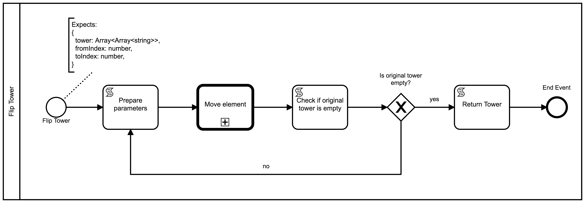

# **Flip Tower**-Diagramm

Wie bereits festgestellt, können wir das Verschieben eines Turmes mit
einem Prozess zum Umdrehen vereinfachen. Dieser Prozess wird Elemente
von einer Position `fromIndex` zu einer Position `toIndex`
verschieben, bis der `fromIndex`-Turm leer ist.



## StartEvent

Genau wie der [`Move Element`-Prozess](./move_element.md) wird auch
dieser Prozess über eine CallActivity aufgerufen.

<image src="./images/flip_tower__start.png" width="50%" />

Für unsere Übersicht behaften wir auch hier das StartEvent mit einer
TextAnnotation, welche Aufschluss über die erwarteten
Übergabeparameter gibt:

```
Expects:
{
  tower: Array<Array<string>>,
  fromIndex: number,
  toIndex: number,
}
```

Zudem benennen wir die ID des StartEvents `startevent_arguments`
für einen erleichterten Zugriff auf die Parameter.

## ScriptTask `Prepare parameters`

Bevor wir die CallActivity aufrufen, müssen zunächst die
Übergabeparameter vorbereitet werden. CallActivities übernehmen als
Parameter immer den aktuellsten Tokenwert.

Zunächst erstellen wir daher einen ScriptTask mit folgendem Code:

```js
return {
  tower: token.history.startevent_arguments.tower,
  fromIndex: token.history.startevent_arguments.fromIndex,
  toIndex: token.history.startevent_arguments.toIndex,
}
```

> Zur Erinnerung: Beim [`Move Element`-Diagramm](./move_element.md) haben wir dieses Format zur
> Übersicht per Text-Annotation vermerkt.

Wir vergeben den Namen `Prepare parameters`.

<image src="./images/flip_tower__prepare_params.png" width="50%" />

## CallActivity `Move Element`

<image src="./images/flip_tower__call_move_element.png" width="50%" />

Anschließend erstellen wir die CallActivity. Wir verlinken das zuvor
erstellte [`Move Element`-Diagramm](./move_element.md) und setzen den
Namen auf `Move Element` und die ID auf `callactivity_move_element`.

## ScriptTask `Check if original tower is empty`

Mit einem weiteren ScriptTask kontrollieren wir, ob wir den
gewünschten Endzustand erreicht haben.

<image src="./images/flip_tower__check_if_done.png" width="50%" />

Der Prozess soll dann stoppen, wenn der Ausgangsturm an der Position
`fromIndex` leer ist. Dies können wir mit folgendem Programmcode
überprüfen:

```js
return token.history.startevent_arguments.tower[token.history.startevent_arguments.fromIndex].length === 0;
```

Wir versehen den ScriptTask mit der ID `servicetask_check_if_done` und
dem Namen `Check if original tower is empty`.

## ExclusiveGateway

Dem ScriptTask folgend erstellen wir ein Gateway mit dem Namen `Is
original tower empty?`.

### ScriptTask `Return towers`

Wenn der vorherige ScriptTask `true` zurückgibt, also der Ausgangsturm
leer ist, möchten wir den Prozess beenden. Zuvor müssen wir allerdings
die Parameter zur Ausgabe aufbereiten. Der Prozess `Flip Tower` wird
als CallActivity aufgerufen und wir müssen im letzten Knoten das
Ergebnis aufbereiten, da dieses auch als Ergebnis beim Aufruf der
CallActivity angezeigt wird.

Wir erstellen einen ScriptTask, wobei wir im PropertyPanel bei
`Script` den folgenden Code eingeben:

```js
return token.history.callactivity_move_element;
```

Der ScriptTask erhält den Namen `Return towers`.

<image src="./images/flip_tower__flow.png" width="50%" />

Wir fügen zudem einen Flow vom Gateway zum ScriptTask mit der Condition
`token.history.servicetask_check_if_done === true` und dem Namen `yes`
(als Antwort auf die Frage, ob der Turm leer ist) zu.

Der ScriptTask wird mit einem EndEvent verbunden.

### Schleife

Bis die Abbruchsbedingung erfüllt ist wollen wir weitere Elemente
bewegen.

Ausgehend vom Gateway erstellen wir einen Flow, welcher zurück zum
ScriptTask mit dem Namen `Prepare parameters` führt.  Der Flow wird mit
`no` bezeichnet und soll die Condition
`token.history.servicetask_check_if_done === false` tragen.
