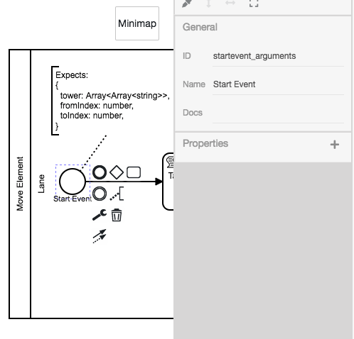
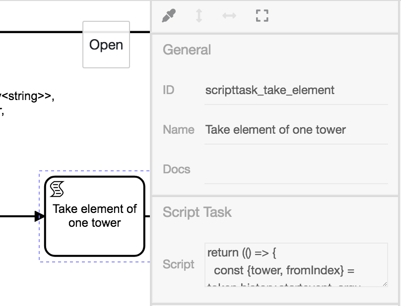

# **Move Element**-Diagramm

Die technische Grundlage für das Turmproblem ist die Möglichkeit das
oberste Element eines Turms auf einen anderen Turm (oder auf die
leere Position `[]`) zu verschieben.
Diese Funktion modellieren wir mit dem Diagramm **Move Element**.


## StartEvent

Dieses Diagramm wird über eine CallActivity aufgerufen. Normalerweise
wird bei Prozessstart ein neuer, leerer Token generiert.
Aber da dieser Prozess per CallActivity aufgerufen wird, wird das
Token beim StartEvent dieses Prozesses den letzten Tokenwert tragen,
welcher vor Aufruf der CallActivity bestand.



Für unsere Übersicht behaften wir das StartEvent mit einer
TextAnnotation, welche auf die erwarteten Startparameter verweist.

```
Expects:
{
  tower: Array<Array<string>>,
  fromIndex: number,
  toIndex: number,
}
```

Um komfortabel auf diese Startparameter zugreifen zu können, vergeben
wir eine neue ID `startevent_arguments`.


## ScriptTask `Take element of one tower`

Die eigentliche Funktionalität bewältigen wir mit ScriptTasks.



Wir hängen einen neuen ScriptTask an das StartEvent mit dem Namen
`Take element of one tower` und der ID `scripttask_take_element`.

Mit der `return`-Anweisung können wir den Token um einen Wert
anreichern. Da unser Programm aus mehr als einem Ausdruck besteht,
erstellen wir eine Funktion und führen diese unmittelbar aus.

Folgender Programmcode entfernt ein Element von dem Turm an der Stelle
`fromIndex`. Sowohl der aktualisierte Zustand der Türme, als auch das
entfernte Element werden zurückgegeben.

```js
return (() => {
  const {tower, fromIndex} = token.history.startevent_arguments;
  const element = tower[fromIndex].pop();
  return {
      tower: tower,
      element: element,
  };
})();
```

Der Programmcode muss in das Feld `Script` im PropertyPanel eingefügt
werden.

## ScriptTask `Put element onto another tower`

Wir erstellen einen weiteren ScriptTask mit dem Namen `Put element
onto another tower`. Wir müssen das zuvor entfernte Element noch auf
den Turm an der Stelle `toIndex` hinzufügen.

Hier fügen wir bei `Script` diesen Programmcode ein:

```js
return (() => {
  const {tower, element} = token.history.scripttask_take_element;
  const {toIndex} = token.history.startevent_arguments;
  tower[toIndex].push(element);
  return tower;
})();
```

Der ScriptTask wird mit dem EndEvent verknüpft. Der Wert, der am
EndEvent ankommt, wird auch als Ergebnis der CallActivity
zurückgegeben.
