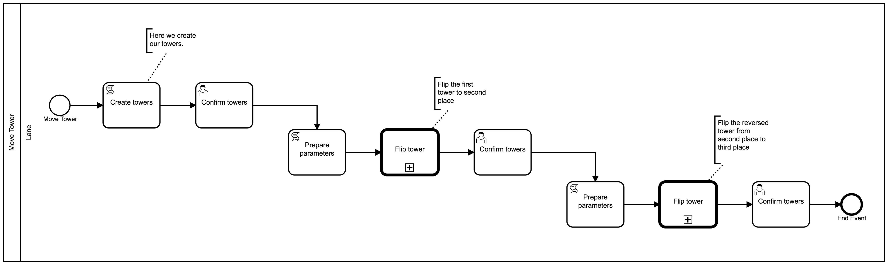

# **Move Tower**-Diagramm

Mithilfe der Diagramme [Move Element](./move_element.md) und
[Flip Tower](./flip_tower.md) können wir den `Move Tower`-Prozess
modellieren.

Der Ablauf sieht folgendermaßen aus:

1. Wir erstellen die Ausgangssituation (`[["A", "B", "C"], [], []]`),
1. wir stellen den Turm auf den Kopf von Position `0` zu Position `1`
   (`[[], ["C", "B", "A"], []]`)
1. und machen dasselbe nochmal von Position `1` zu Position `2` (`[[],
   [], ["A", "B", "C"]]`).

Als kleinen Zusatz stellen wir wiederholt den Zustand der Türme in Textform dar,
damit wir sehen können, dass es wirklich funktioniert.



## ScriptTask `Create towers`

<image src="./images/move_tower__create_towers.png" width="50%" />

Wir erstellen die Türme mit einem ScriptTask mit dem Code:

```js
return [["A", "B", "C"], [], []];
```

Der ScriptTask erhält von uns den Namen `Create towers` und die ID
`scripttask_create_towers`.

## UserTask `Confirm towers`

Wir möchten dem Anwender gerne den Startzustand präsentieren.  Wir
erreichen dies mit einem Confirm-UserTask und dem Wert
`${JSON.stringify(token.current)}` als Label fürs Formfield.

> Das **Hello World**-Beispiel zeigt Confirm-UserTasks im Detail.

## Turm umdrehen

Das Umdrehen eines Turms besteht in unserer Modellierung aus drei
Schritten:

1. ScriptTask `Prepare parameters` zum Vorbereiten für die
   CallActivity
1. CallActivity `Flip Tower` zum Umdrehen eines Turms
1. UserTask `Confirm towers` zum Darstellen des neuen Zustands


### ScriptTask `Prepare parameters`

<image src="./images/move_tower__prepare_params.png" width="50%" />

Der ScriptTask enthält den Code:

```js
return {
  tower: token.history.scripttask_create_towers,
  fromIndex: 0,
  toIndex: 1,
};
```

> Zur Erinnerung: Beim **Flip Tower**-Diagramm haben wir dieses
> Format zur Übersicht per Text-Annotation vermerkt.

### CallActivity `Flip Tower`

<image src="./images/move_tower__call_flip_tower.png" width="50%" />

Die CallActivity erhält die ID `callactivity_flip_tower` und verweist
auf den **Flip-Tower**-Prozess.

### UserTask `Confirm towers`

Der Confirm-UserTask soll das Ergebnis der CallActivity anzeigen. Im
Label des FormFields steht also wieder
`${JSON.stringify(token.current)}`.

## Turm erneut umdrehen

Jetzt muss der Turm erneut umgedreht werden: dieses Mal jedoch von
Position `1` auf `2`.

Wir bauen diesselbe Struktur mit ScriptTask, CallActivity und UserTask
wie zuvor auf. Der einzige Unterschied in der Modellierung sind die übergebenen
Parameter.

Dieses Mal fügen wir als `Script` beim ScriptTask Folgendes hinzu:

```js
return {
  tower: token.history.callactivity_flip_tower,
  fromIndex: 1,
  toIndex: 2,
};
```
