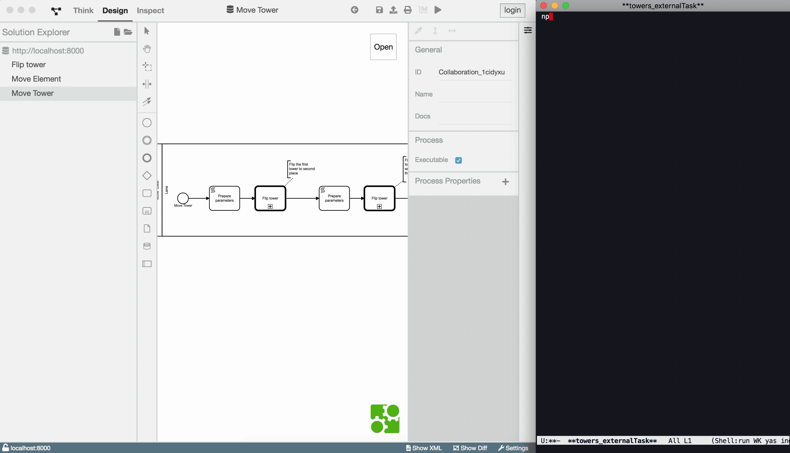

# Towers mit ExternalTasks

In dem vorherigen Beispiel haben wir es uns zur Aufgabe gemacht
Turmstapel auf den Kopf zu drehen. Die Komplexität konnten wir
erfolgreich verringern, indem wir mehrere Diagramme erstellt und mit
CallActivities verbunden haben.

Ein Faktor blieb jedoch verwirrend: der Zustand der
Türme wurde innerhalb des Prozesses erstellt und gepflegt. Es wurde
immer nur im Token festgehalten, wie die Türme aussehen. Es bestand
keine Kommunikation nach außen.

Wir erweitern das Beispiel so, dass der Zustand der Türme extern
verwaltet wird. Dies erreichen wir mit ExternalTasks.

Dieses Beispiel demonstriert die Austauschbarkeit technischer Elemente
bei Prozessen.

Auch hier werden Prozessmodellierung und Softwareentwicklung getrennt
betrachtet:

- Prozessmodellierung
  - [Move Element](./README_move_element.md)
  - [Flip Tower](./README_flip_tower.md)
  - [Move Tower](./README_move_tower.md)
- [Softwareentwicklung](./README_programmer.md)

## Lernziele

- Austauschen von technischen Aspekten bei Diagrammen

## Ablauf

So sieht der Ablauf der Applikation aus:

</img>
