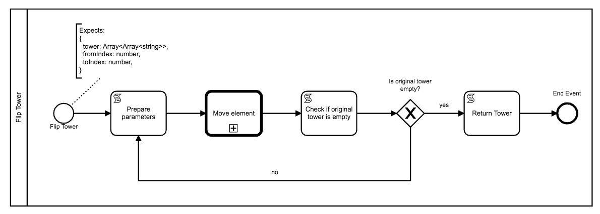
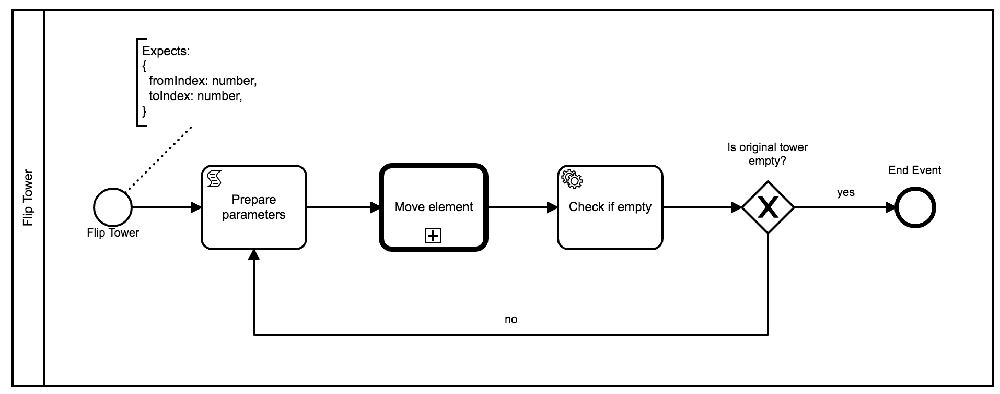
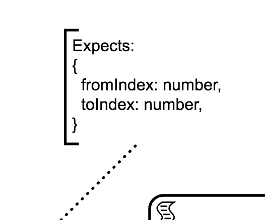
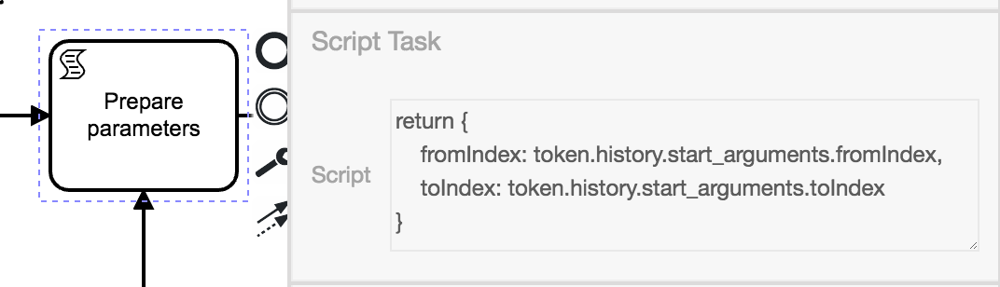
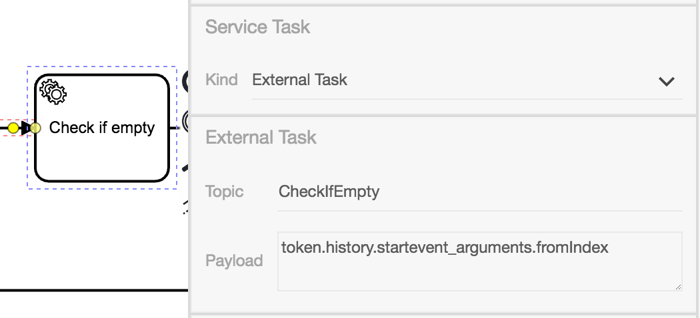

# Anleitung für **Flip Tower**-Diagramm

Diese Anleitung beschreibt das Anpassen des **Flip Tower**-Diagramms
zum ExternalTask Muster.

So sieht das ursprüngliche Diagramm aus:



Und hier folgt ein Bild des abgeänderten Diagramms:



## Annotation

Der `tower`-Parameter wurde ursprünglich genutzt um den Zustand der
Türme zu beschreiben. Nun wird der Zustand in einer externen
Applikation gepflegt und der Eintrag kann gelöscht werden.



> Annotationen dienen der eigenen Übersicht und haben keine technische
> Auswirkung. Hier wurde die Annotation genutzt, um den Typ des
> erwarteten Payloads des Prozesses zu kennzeichnen.

## **Prepare Parameters**-ScriptTask

Auch beim ScriptTask kann der Parameter `tower` entfernt werden.

Somit ergibt die sich folgendes Script:

```js
return {
    fromIndex: token.history.start_arguments.fromIndex,
    toIndex: token.history.start_arguments.toIndex
}
```



## **Check if empty**-ExternalTask

Der ScriptTask zur Kontrolle, ob ein Turm abgebaut ist, kann nun
ersetzt werden.

Wir verwenden stattdessen einen ServiceTask und konfigurieren ihn zum ExternalTask.

Hier ist die Konfiguration:

| Eigenschaft | Wert                                         |
|-------------|----------------------------------------------|
| ID          | servicetask_check_if_empty                   |
| Name        | Check if empty                               |
| Topic       | CheckIfEmpty                                 |
| Payload     | token.history.startevent_arguments.fromIndex |

In BPMN-Studio sieht der Task mitsamt Konfiguration so aus:


