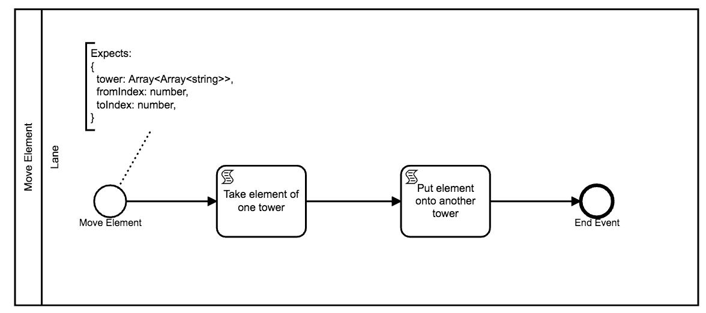
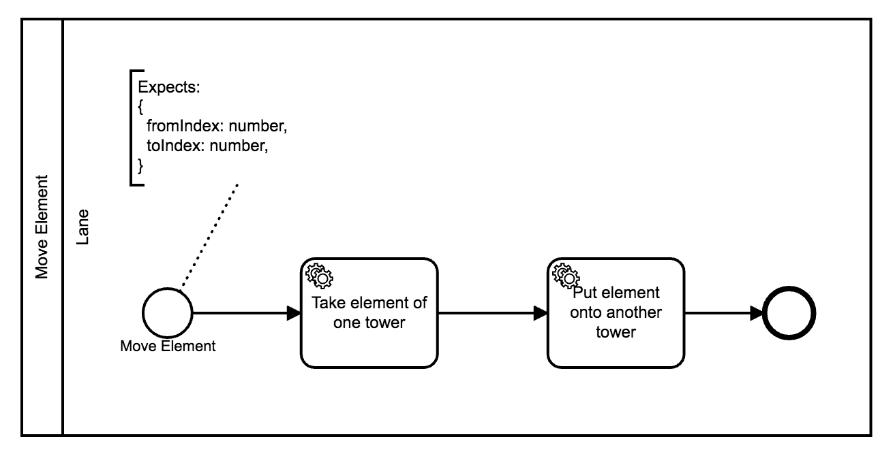
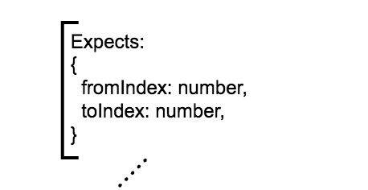
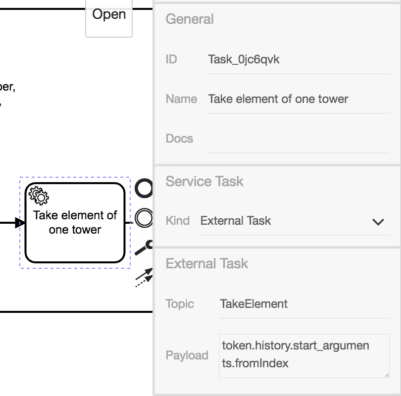
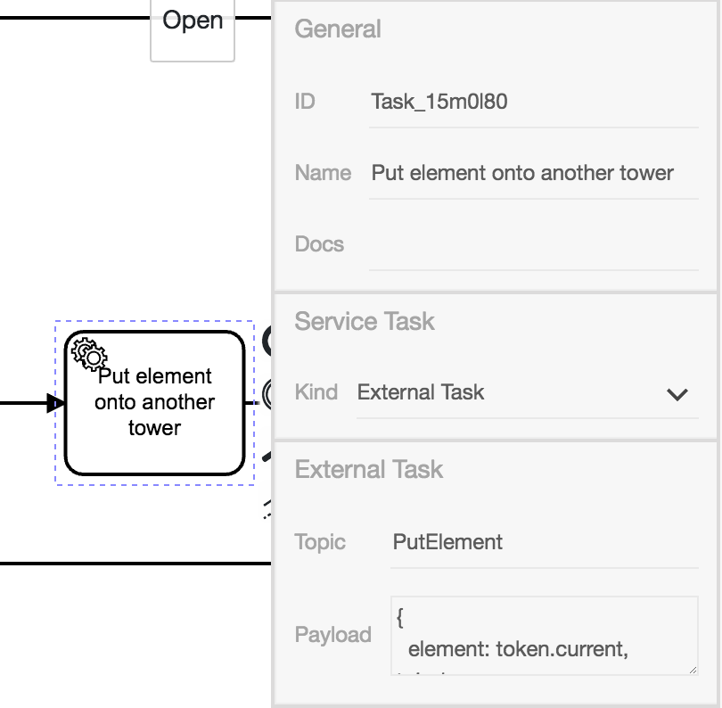

# Anleitung für **Move Element**-Diagramm

In dieser Anleitung wird beschrieben, wie wir die Script-Tasks des
ursprünglichen **MoveElement**-Diagramms mit External-Tasks ersetzen
können.

Die Script-Tasks beinhalteten komplexe Logik um die Türme zu
manipulieren. Das External-Task-Muster erlaubt uns diese Logik auf
einen Server auszulagern. Somit überlassen wir dem Diagramm allein die
Steuerung des Prozesses, und nicht die Umsetzung.

Das originale Diagramm sieht so aus:



Das neue Diagramm macht einen nahezu identischen Anschein:



## Startannotation

Der Zustand der Türme wird nicht mehr über die Prozesse
weitergereicht. Daher können wir den Eintrag `tower` aus der
Annotation löschen.



## Take Element

Der Scriptask `Take element of one tower` kann gelöscht werden.

Zum Ersatz erstellen wir einen gleichnamigen Service-Task und
konfigurieren ihn zum `ExternalTask`.  Als Topic wählen wir
`TakeElement` und wir benutzen
`token.history.start_arguments.fromIndex` als Payload.

Hier ist ein Bild des konfigurierten Script-Tasks:



## Put Element

Der folgende Script-Task `Put element` wird ebenfalls mit einem
External-Task ersetzt.

Das Topic `PutElement` wird benötigt, damit der Worker sich unter
diesem Namen für den Task registrieren kann.

Um zu beschreiben, welches Element auf welchen Turm gelegt werden
muss, wählen wir die folgende Payload:

```js
{
  element: token.current,
  toIndex: token.history.start_arguments.toIndex,
}
```

So sieht der konfigurierte Task aus:


