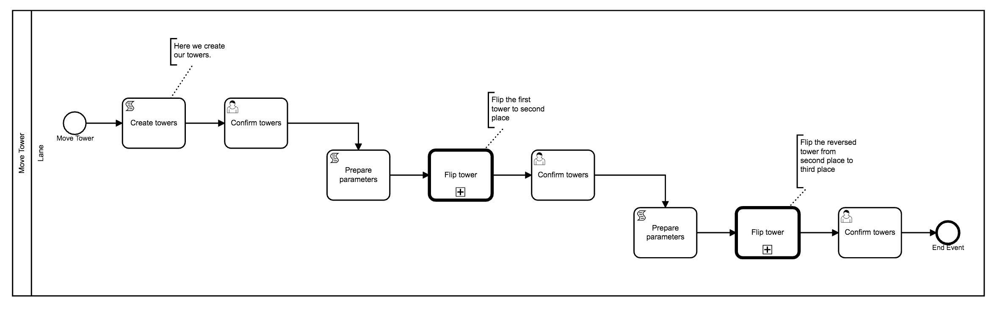
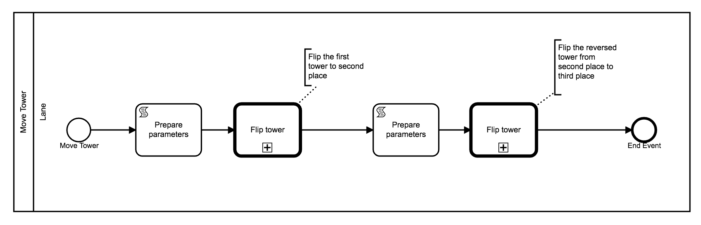

# Anleitung für **Move Tower**-Diagramm

Folgend wird der Umbau des **Move Tower**-Diagramms beschrieben.

Hierbei handelt es sich um eine starke Vereinfachung. Wir verwalten
die Türme nicht mehr in den Diagrammen und benötigen keine UserTasks
zur Anzeige.

Das ursprüngliche Diagramm sieht so aus:



Nach Umbau sieht das Diagramm so aus:



## Elemente entfernen

Es können alle Elemente außer StartEvent, EndEvent, den ScriptTasks
und den CallActivities gelöscht werden.

## **Prepare Parameters**-ScriptTasks

Bei den ScriptTasks kann die Eigenschaft `tower` aus den Parametern entfernt werden.

Für den ersten ScriptTask ergibt sich:

```js
return {
  fromIndex: 0,
  toIndex: 1,
};
```

Und beim zweiten ScriptTask sehen die Parameter so aus:

```js
return {
  fromIndex: 1,
  toIndex: 2,
};
```
